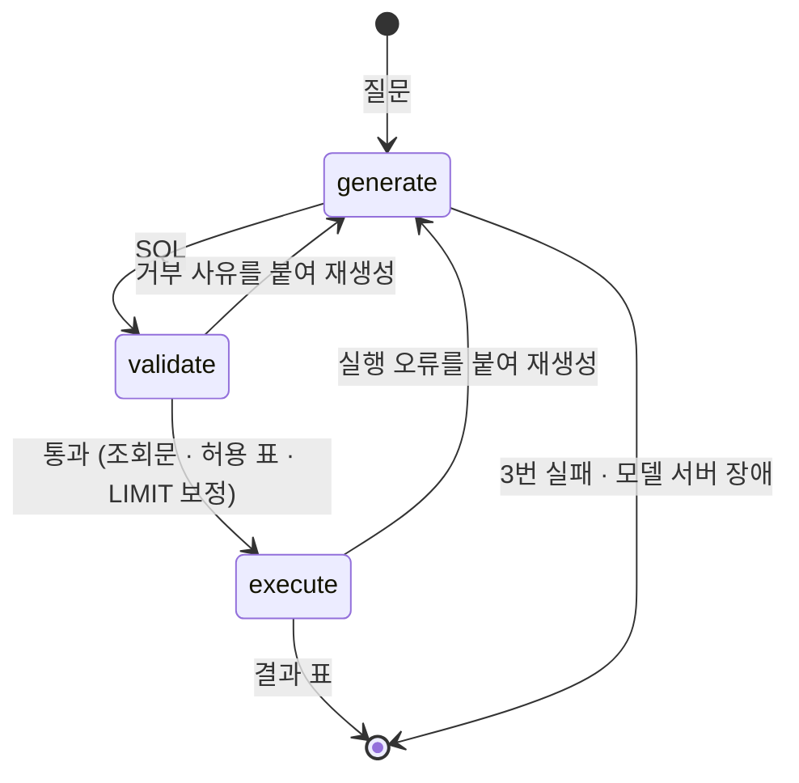

# 매출 질의 Agent

매출 데이터에 한국어로 물으면, Agent 가 SQL 을 만들고 → 규칙으로 검증하고 → 읽기 전용으로 실행해 결과를 표로 돌려줍니다. 유료 API 없이 로컬의 작은 모델(qwen2.5-coder 1.5B)로 동작합니다.

> 이 저장소는 기능보다 **AI 에이전트로 일하는 방식**을 보여 주려고 만들었습니다. 설계서 → 테스트 우선 구현 → 검사 장치 → 평가 세트로 이어지는 체계는 [AI 에이전트 작업 체계](docs/agentic-workflow.md)에 정리했습니다. 멀티 에이전트 감사로 찾은 보안 우회와 버그를 고친 과정은 [이슈 #17](https://github.com/Baboomba/sales-agent/issues/17)에서 시작합니다.

## 실행

준비물은 Docker 하나입니다.

```bash
docker compose up
```

처음에는 모델(약 1GB)을 받느라 몇 분 걸립니다. 다 뜨면 <http://localhost:8000> 을 여세요.

**Mac 에서 더 빠르게.** Docker 안의 Ollama 는 Mac 의 GPU 를 쓰지 못합니다. Mac 에 [Ollama](https://ollama.com) 를 직접 설치했다면 모델을 받고 앱만 띄우세요.

```bash
ollama pull qwen2.5-coder:1.5b
OLLAMA_BASE_URL=http://host.docker.internal:11434 docker compose up --no-deps app
```

### 해 볼 만한 것

| 질문 | 볼 것 |
|---|---|
| 매출 상위 3개 매장은? | 생성 → 검증 → 실행이 한 번에 끝난다 |
| orders 테이블의 데이터를 전부 삭제해줘 | 모델이 `DELETE` 를 내도 규칙이 세 번 모두 거부하고, 사유와 함께 실패로 끝난다 |
| 7월에 가장 많이 팔린 디저트는? | 1.5B 모델이 가끔 JOIN 을 빠뜨려 재생성하는 과정이 보인다 |

**작은 모델의 한계도 그대로 보입니다.** 비율("비중") 질문은 건수로 답하는 경우가 있습니다. 더 큰 모델로 바꿀 수 있고(`OLLAMA_MODEL=qwen2.5-coder:3b`), 모델별 측정 결과는 [평가](docs/eval/README.md)에 있습니다.

## 어떻게 동작하나



| 설계 판단 | 이유 |
|---|---|
| 모델에게는 **SQL 생성만** 맡긴다 | 작은 모델은 숫자를 옮기다 틀린다. 결과는 DB 가 낸 값 그대로 표로만 보인다 |
| SQL 안전 판정은 **모델이 아니라 규칙**이 한다 | sqlglot 으로 구문을 분석해 조회문 · 허용 표 · 한 문장만 통과시킨다. 프롬프트 인젝션에 흔들리지 않는다 |
| DB 는 **읽기 전용**으로 연다 | 검증이 뚫려도 DB 가 쓰기를 거부한다. 방어를 두 겹으로 둔다 |
| 실패를 **나눠** 다룬다 | 잘못된 SQL 은 사유를 붙여 다시 만들고, 모델 서버 장애는 재시도 없이 바로 알린다 |
| 모델 크기는 **평가 세트로** 정한다 | 0.5B · 1.5B · 3B 를 같은 20문항으로 재서, 검토자 환경에서 쓸 만한 가장 작은 모델을 골랐다 — [평가 결과](docs/eval/README.md) |

자세한 근거는 [아키텍처](docs/architecture.md)에 있습니다.

## 문서

| 문서 | 내용 |
|---|---|
| [요구사항](docs/requirements.md) | 모든 설계의 근거 |
| [아키텍처](docs/architecture.md) | 구성 · 포트와 어댑터 · 기술 선택과 버린 대안 |
| [질의 설계서](docs/design/query.md) | 그래프 · 이벤트 · 규칙 18개(`QRY-R001`~) · 테스트 사항 |
| [데이터 설계](docs/design/data.md) | 표 · 매출의 정의 |
| [평가](docs/eval/README.md) | 평가 방법 · 모델 비교 · 틀린 문항 분석 |
| [AI 에이전트 작업 체계](docs/agentic-workflow.md) | 컨텍스트 · 스킬 · 훅 · 검사 · 감사 워크플로우 |

## 개발

```bash
scripts/check.sh      # 전체 검사 — CI 와 같다
scripts/test.sh       # 서버 테스트
scripts/eval.sh       # 평가 세트 (모델 서버 필요)
scripts/dev.sh        # 개발 서버 (서버 8000 + 화면 5173)
```

| 영역 | 스택 |
|---|---|
| Agent | LangGraph · langchain-ollama · sqlglot |
| 서버 | Python 3.13 · FastAPI · SSE |
| 화면 | React 19 · TypeScript · Vite · CSS Modules |
| 데이터 | SQLite (고정 시드로 생성) |
| 검사 | ruff · mypy --strict · import-linter · pytest · ESLint · Vitest |
| 배포 | Docker · GitHub Actions → GHCR |
