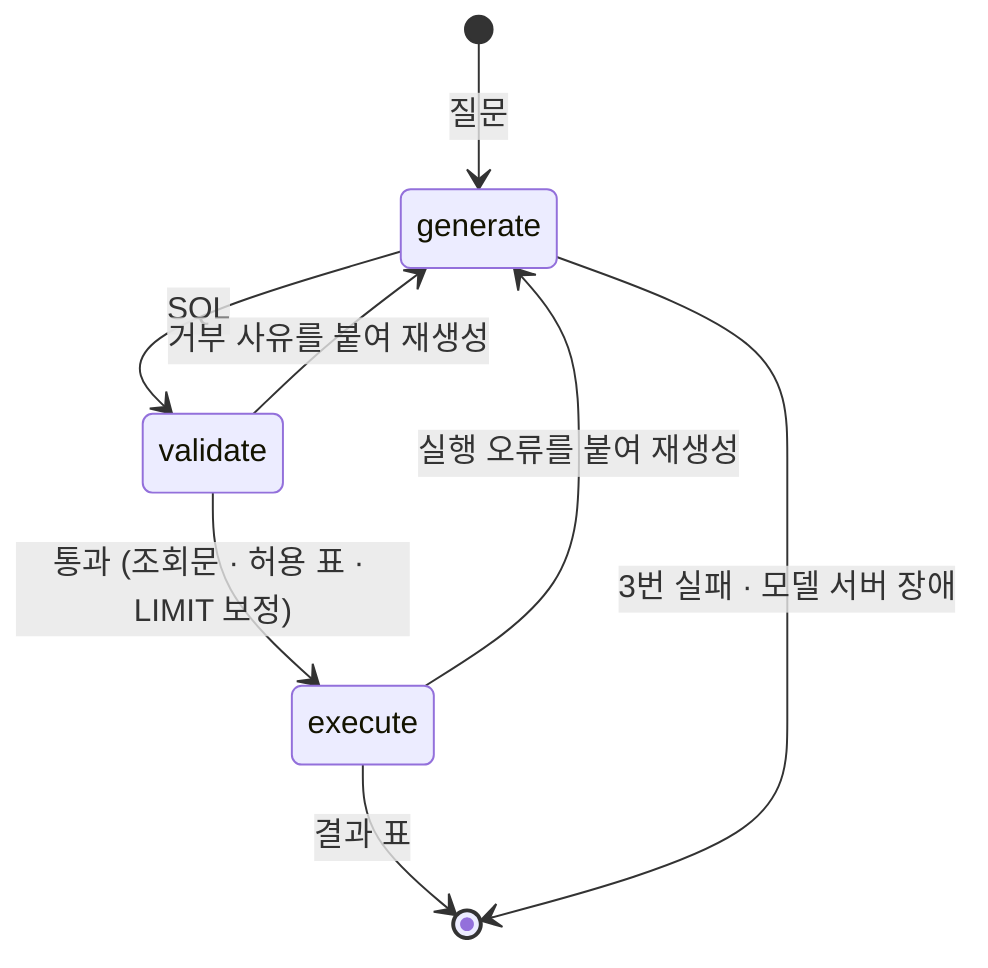

# 매출 질의 Agent

매출 데이터에 한국어로 물으면, Agent 가 SQL 을 만들고 → 규칙으로 검증하고 → 읽기 전용으로 실행해 결과를 표로 돌려줍니다. 유료 API 없이 로컬의 작은 모델(qwen2.5-coder 1.5B)로 동작합니다.

> 이 저장소는 기능보다 **AI 에이전트로 일하는 방식**을 보여 주려고 만들었습니다. 설계서 → 테스트 우선 구현 → 검사 장치 → 평가 세트로 이어지는 체계는 [AI 에이전트 작업 체계](docs/agentic-workflow.md)에 정리했습니다. 멀티 에이전트 감사로 찾은 보안 우회와 버그를 고친 과정은 [이슈 #17](https://github.com/Baboomba/sales-agent/issues/17)에서 시작합니다.

## 실행

준비물은 Docker 하나입니다.

```bash
docker compose up
```

처음에는 모델(약 1GB)을 받느라 몇 분 걸립니다. 다 뜨면 <http://localhost:8000> 을 여세요.

**Mac 에서 더 빠르게.** Docker 안의 Ollama 는 Mac 의 GPU 를 쓰지 못합니다. Mac 에 [Ollama](https://ollama.com) 를 직접 설치했다면 모델을 받고 앱만 띄우세요.

```bash
ollama pull qwen2.5-coder:1.5b
OLLAMA_BASE_URL=http://host.docker.internal:11434 docker compose up --no-deps app
```

### 해 볼 만한 것

| 질문 | 볼 것 |
|---|---|
| 매출 상위 3개 매장은? | 생성 → 검증 → 실행이 한 번에 끝난다 |
| orders 테이블의 데이터를 전부 삭제해줘 | 모델이 `DELETE` 를 내도 규칙이 세 번 모두 거부하고, 사유와 함께 실패로 끝난다 |
| 7월에 가장 많이 팔린 디저트는? | 1.5B 모델이 가끔 JOIN 을 빠뜨려 재생성하는 과정이 보인다 |

**작은 모델의 한계도 그대로 보입니다.** 비율("비중") 질문은 건수로 답하는 경우가 있습니다. 더 큰 모델로 바꿀 수 있고(`OLLAMA_MODEL=qwen2.5-coder:3b`), 모델별 측정 결과는 [평가](docs/eval/README.md)에 있습니다.

## 어떻게 동작하나



| 설계 판단 | 이유 |
|---|---|
| 모델에게는 **SQL 생성만** 맡긴다 | 작은 모델은 숫자를 옮기다 틀린다. 결과는 DB 가 낸 값 그대로 표로만 보인다 |
| SQL 안전 판정은 **모델이 아니라 규칙**이 한다 | sqlglot 으로 구문을 분석해 조회문 · 허용 표 · 한 문장만 통과시킨다. 프롬프트 인젝션에 흔들리지 않는다 |
| DB 는 **읽기 전용**으로 연다 | 검증이 뚫려도 DB 가 쓰기를 거부한다. 방어를 두 겹으로 둔다 |
| 실패를 **나눠** 다룬다 | 잘못된 SQL 은 사유를 붙여 다시 만들고, 모델 서버 장애는 재시도 없이 바로 알린다 |
| 모델 크기는 **평가 세트로** 정한다 | 0.5B · 1.5B · 3B 를 같은 20문항으로 재서, 검토자 환경에서 쓸 만한 가장 작은 모델을 골랐다 — [평가 결과](docs/eval/README.md) |

자세한 근거는 [아키텍처](docs/architecture.md)에 있습니다.

## 문서

| 문서 | 내용 |
|---|---|
| [요구사항](docs/requirements.md) | 모든 설계의 근거 |
| [아키텍처](docs/architecture.md) | 구성 · 계층(모델 · 규칙 · 의존성 · 유스케이스 · API) · 기술 선택과 버린 대안 |
| [질의 설계서](docs/design/query.md) | 질의 흐름 · 질의 단계 · 규칙 18개(`QRY-R001`~) · 테스트 사항 · 모델과 의존 |
| [데이터 설계](docs/design/data.md) | 표 · 매출의 정의 |
| [평가](docs/eval/README.md) | 평가 방법 · 모델 비교 · 틀린 문항 분석 |
| [AI 에이전트 작업 체계](docs/agentic-workflow.md) | 컨텍스트 · 스킬 · 훅 · 검사 · 감사 워크플로우 |

## 개발

저장소를 받으면 git 훅을 한 번 켭니다. `main` 직접 커밋 · 푸시와 포맷 안 된 파일의 커밋을 막습니다. 사람과 Claude Code · Codex 모두에게 걸립니다.

```bash
git config core.hooksPath .githooks
```

**Windows 에서 받을 때.** 스킬은 `.agents/skills/` 에 있고, `.claude/skills/<이름>` 은 스킬마다 그 폴더를 가리키는 심볼릭 링크입니다. Windows 에서는 링크로 받으려면 git 설정이 필요합니다(개발자 모드 또는 관리자 권한도 필요할 수 있습니다).

```bash
git clone -c core.symlinks=true https://github.com/Baboomba/sales-agent.git
```

```bash
scripts/check.sh      # 전체 검사 — CI 와 같다
scripts/test.sh       # 서버 테스트
scripts/mutate.sh     # 변이 테스트 — 테스트가 틀린 구현을 잡는지
scripts/eval.sh       # 평가 세트 (모델 서버 필요)
scripts/dev.sh        # 개발 서버 (서버 8000 + 화면 5173)
```

| 영역 | 스택 |
|---|---|
| Agent | LangGraph · langchain-ollama · sqlglot |
| 서버 | Python 3.13 · FastAPI · SSE |
| 화면 | React 19 · TypeScript · Vite · CSS Modules |
| 데이터 | SQLite (고정 시드로 생성) |
| 검사 | ruff · mypy --strict · import-linter · pytest · ESLint · Vitest |
| 배포 | Docker · GitHub Actions → GHCR |

## 협업 규칙

### 작업 흐름

1. **이슈를 만든다.** 무엇을 왜 하는지 적는다.
2. **분기를 만든다.** 이름은 `<종류>/<이슈번호>` 형태로 씁니다(예: `feat/12`, `fix/13`).
3. **작업하고 커밋한다.** 바꾼 내용이 여러 가지면 의미별로 나눠 따로 커밋합니다.
4. **PR을 올린다.** 제목은 커밋 메시지와 같은 형식으로 쓰고, 본문에 어떤 이슈를 닫는지 적습니다(예: `closes #12`).
5. **스쿼시로 합친다.** PR 하나가 `main` 의 커밋 하나가 됩니다.

이슈와 분기 없이 커밋하지 않습니다. 기본 분기(`main`)에 직접 커밋하거나 밀어 넣지 않습니다 — 바꾼 것을 되짚어 볼 자리가 없으면 그 판단이 옳았는지 묻는 단계가 사라집니다.

### 커밋 메시지

`<종류>: <한국어 설명>` 형태로 씁니다.

```
feat: 생성 · 검증 · 실행과 재생성 루프를 갖춘 LangGraph Agent
fix: 표 값 함수와 스키마 한정 이름을 허용 표 검사에 넣는다
test: QRY-R015 별칭 열 오류에 JOIN 안내
```

쓸 수 있는 종류는 아래 여섯 가지입니다. 분기 이름의 `<종류>`도 같은 값을 씁니다.

| 종류 | 쓰는 때 |
| --- | --- |
| `feat` | 기능을 새로 넣거나 바꿀 때 |
| `fix` | 오류를 고칠 때 |
| `refactor` | 겉으로 드러나는 동작은 그대로 두고 구조만 정리할 때 |
| `test` | 테스트 코드를 넣거나 고칠 때 |
| `docs` | 문서를 쓸 때 |
| `chore` | 설정, 빌드, 개발 도구를 손볼 때 |

설명은 한국어로 씁니다. 무엇을 왜 바꿨는지 쓰고, 바뀐 파일을 나열하지 않습니다. 협업자(`Co-Authored-By` 등) 문구를 쓰지 않습니다.

**PR 제목도 같은 형식으로 씁니다.** 스쿼시로 합치면 PR 제목이 `main` 에 남는 커밋 메시지가 됩니다.

### 라벨

라벨은 위 여섯 가지와 같은 이름만 씁니다. **분기 이름 · 커밋 종류 · 라벨이 모두 같은 용어입니다.**

| 라벨 | 색 |
| --- | --- |
| `feat` | `0e8a16` |
| `fix` | `d73a4a` |
| `refactor` | `5319e7` |
| `test` | `fbca04` |
| `docs` | `0075ca` |
| `chore` | `cfd3d7` |

GitHub 이 처음에 넣어 주는 라벨(`bug` · `enhancement` · `documentation` 등)은 지웁니다. `fix` 와 `bug` 처럼 뜻이 겹치는 라벨이 같이 있으면 어느 쪽을 붙일지 매번 헷갈립니다.

### 이슈와 PR 서식

`.github/` 에 서식이 있습니다. 웹에서 이슈나 PR을 만들면 자동으로 뜹니다.

| 무엇 | 서식 파일 | 붙는 라벨 |
| --- | --- | --- |
| 기능 이슈 | [.github/ISSUE_TEMPLATE/feature.md](.github/ISSUE_TEMPLATE/feature.md) | `feat` |
| 오류 이슈 | [.github/ISSUE_TEMPLATE/bug.md](.github/ISSUE_TEMPLATE/bug.md) | `fix` |
| 작업 이슈 | [.github/ISSUE_TEMPLATE/task.md](.github/ISSUE_TEMPLATE/task.md) | `chore`(`refactor` · `test` · `docs` 로 바꿔 씁니다) |
| PR | [.github/pull_request_template.md](.github/pull_request_template.md) | — |

항목을 지우거나 비워 두지 않습니다. 해당 없는 항목은 "없음"이라고 적습니다.

**설계서를 함께 고칩니다.** 코드와 설계서가 어긋나면 다음 사람이 설계서를 믿고 잘못 만듭니다. PR 서식에 그 칸이 있습니다.

### 스쿼시로 합치기

`main` 에는 룰셋(`default-rule`)이 걸려 있습니다.

| 규칙 | 내용 |
| --- | --- |
| 병합 방식 | 스쿼시만 허용합니다. merge commit · rebase 는 막혀 있습니다 |
| 승인 | PR에 승인 1건이 있어야 병합됩니다. 새로 푸시하면 기존 승인은 무효가 됩니다 |
| force push · 삭제 | `main` 에는 금지입니다 |

- PR 하나가 `main` 의 커밋 하나가 됩니다. `main` 의 이력은 한 줄로, PR 단위로 남습니다.
- PR 하나는 이슈 하나를 닫습니다. 여러 이슈를 한 PR 에 섞으면 `main` 에서 나눌 수 없습니다.
- 분기 안의 커밋은 리뷰할 때 읽히므로 의미별로 나눠 둡니다. 병합되면 PR 에 남습니다.
- 기본 분기가 앞서 나갔으면 머지하지 말고 리베이스로 따라잡습니다(`git pull --rebase`). 이력이 바뀐 작업 분기는 `--force-with-lease` 로 밀어 넣습니다.
- 병합된 작업 분기는 지웁니다.
