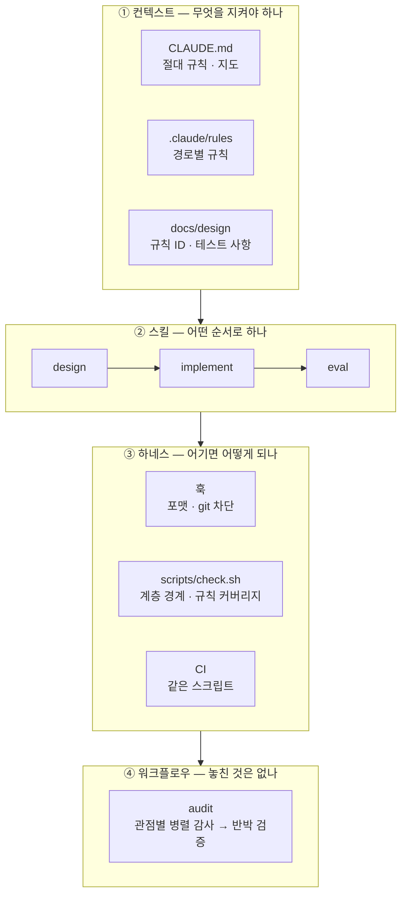

# AI 에이전트 작업 체계

이 저장소는 Claude Code 로 만들었다. 에이전트에게 코드를 맡기되, **에이전트를 믿지 않고 검증하는 구조**를 먼저 깔았다. 이 문서는 그 구조를 설명한다.

## 한눈에

## ① 컨텍스트 — 에이전트가 읽는 것

| 자리 | 무엇을 | 언제 읽히나 |
|---|---|---|
| `CLAUDE.md` | 절대 규칙, 실행 명령, 저장소 지도 | 세션마다 |
| `.claude/rules/*.md` | 계층별 할 수 있는 것 · 없는 것 | 해당 경로의 파일을 다룰 때만 (`paths:`) |
| `docs/design/*.md` | 규칙 ID 와 테스트 사항 | 스킬이 읽게 한다 |

**규칙을 경로별로 나눈 이유.** 한 파일에 모든 규칙을 두면 화면을 고칠 때도 서버 규칙이 컨텍스트를 차지한다. `paths:` 로 범위를 걸어 필요한 규칙만 들어가게 했다.

## ② 스킬 — 일하는 순서

| 스킬 | 순서 | 사람이 멈추는 자리 |
|---|---|---|
| `design` | 근거 찾기 → 영향 → 초안 → 승인 → 반영 | 초안 뒤 |
| `implement` | 설계서 → 테스트 → **승인** → 실패 확인 → 구현 → 검사 → **승인** | 테스트 뒤 · 구현 뒤 |
| `eval` | 모델 확인 → 실행 → 기준과 비교 → 틀린 문항 분석 → 보고 | 결과 기록 전 |

**승인 자리를 둘로 둔 이유.** 테스트를 본 뒤에 멈추면 "무엇을 만들지" 를 코드 전에 합의할 수 있다. 에이전트가 잘못 이해한 채로 쌓은 코드는 되돌리는 값이 크다.

**스킬은 도구를 직접 부르지 않는다.** `scripts/` 의 명령만 쓴다. 사람이 손으로 돌리는 것, 에이전트가 돌리는 것, CI 가 돌리는 것이 같은 명령이다.

## ③ 하네스 — 말이 아니라 장치로 막는다

규칙을 문서에만 적으면 에이전트는 가끔 어긴다. 그래서 어기면 실패하는 장치를 붙였다.

| 장치 | 무엇을 막나 | 자리 |
|---|---|---|
| 포맷 훅 | 에이전트가 고친 파일을 바로 포맷한다. 포맷 차이로 검사가 실패하는 왕복이 없다 | `.claude/hooks/format.sh` (PostToolUse) |
| git 훅 | `main` 직접 커밋 · 푸시, `--no-verify`, `--force` 를 실행 전에 막는다 | `.claude/hooks/guard-git.sh` (PreToolUse) |
| 계층 경계 | `rules.py` 가 LangGraph 를 import 하거나 그래프가 어댑터를 import 하면 실패 | `import-linter` |
| 규칙 커버리지 | 설계서의 규칙 ID 가 테스트에 없거나, 테스트가 없는 ID 를 적으면 실패 | `tests/test_rule_coverage.py` |
| 타입 | `mypy --strict` · TypeScript `strict` | `scripts/check.sh` |
| CI | 위 전부를 같은 스크립트로 다시 돌린다. 통과한 커밋만 이미지가 된다 | `.github/workflows/ci.yml` |

**우회 금지도 장치로.** `CLAUDE.md` 가 `skip` · `type: ignore` · 린트 끄기를 금지하고, git 훅이 `--no-verify` 를 막는다.

## ④ 워크플로우 — 여러 에이전트가 교차 검증

`.claude/workflows/audit.js` 는 마스터 · 서브 에이전트 구조의 감사 워크플로우다.

| 역할 | 하는 일 | 제한 |
|---|---|---|
| 마스터 (스크립트) | 감사 관점을 나눠 배정하고, 결과를 모아 심각도 순으로 정리 | 판단은 규칙으로 — 반박을 견딘 것만 남긴다 |
| 감사 에이전트 × 4 | 요구사항 커버리지 · 설계와 코드 · 테스트 품질 · 보안(SQL 우회) 중 한 관점만 | 읽기 전용, 근거(파일:줄) 필수 |
| 반박 에이전트 | 지적마다 하나. 틀렸거나 과장됐는지 직접 확인 | 확인할 수 없으면 반박으로 친다 |

**관점을 나눈 이유.** 한 에이전트에게 "전부 봐" 라고 하면 눈에 띄는 것만 본다. 관점을 좁히면 각자 깊이 본다.

**반박 단계를 둔 이유.** 감사 에이전트는 그럴듯하지만 틀린 지적을 낸다. 지적을 그대로 받아 고치면 멀쩡한 코드를 망친다.

**워크플로우는 아무것도 고치지 않는다.** 결과를 사람이 보고, 고칠 것은 이슈로 만들어 `implement` 스킬로 처리한다.
