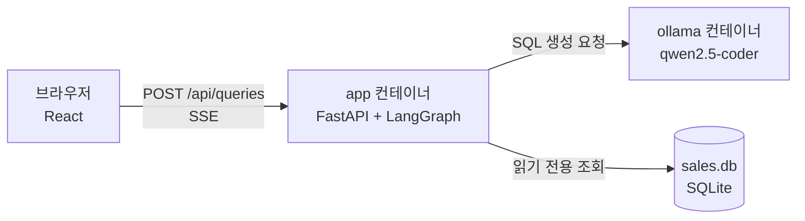

# 아키텍처

## 1. 구성



| 컨테이너 | 하는 일 |
|---|---|
| `app` | API 와 Agent 를 돌리고, 빌드된 React 화면을 함께 내준다. 산출물은 이미지 하나다 |
| `ollama` | 언어 모델 서버. 처음 뜰 때 모델을 받는다 |

**DB 서버가 없다.** SQLite 파일을 이미지에 담는다. 검토자가 설치할 것을 줄이는 것이 목표다(`requirements.md` 1절).

**DB 파일을 저장소에 넣지 않는다.** 23MB 라 저장소가 무거워진다. 시드가 고정이라 이미지를 만들 때 1초 남짓이면 같은 파일이 나온다(`docs/design/data.md`).

**화면과 API 가 같은 출처에서 나온다.** 교차 출처 설정이 필요 없고 배포물이 하나다.

## 2. 서버 코드 구조 — 포트와 어댑터

```text
app/
  main.py               조립 루트. 어댑터를 만들어 그래프에 끼운다
  config.py             환경변수
  query/
    model.py            상태와 이벤트. 아무것도 import 하지 않는다
    rules.py            SQL 검증·LIMIT 보정. 순수 함수
    prompt.py           프롬프트 조립. 순수 함수
    ports.py            밖에서 받는 것의 인터페이스 (SqlGenerator · SalesDatabase)
    graph.py            LangGraph 그래프. 포트만 안다
    api.py              HTTP 경계. 그래프 이벤트를 SSE 로 옮긴다
    adapters/
      ollama.py         SqlGenerator 구현
      sqlite.py         SalesDatabase 구현
```

**의존은 안쪽으로만 향한다.**

```text
api ──▶ graph ──▶ rules · prompt ──▶ model
          │
          └──▶ ports ◀── adapters (구현)
```

* `model` · `rules` · `prompt` 는 LangGraph 도, FastAPI 도, 어댑터도 모른다. 그래서 모델 없이 테스트된다(NFR-005).
* `graph` 는 포트만 안다. Ollama 를 다른 모델 서버로 바꿔도 그래프는 그대로다.
* 어댑터를 아는 곳은 `main.py` 하나다.

**이 경계는 사람이 지키지 않는다.** `import-linter` 가 CI 에서 검사한다(`pyproject.toml` 의 `[tool.importlinter]`).

## 3. 왜 이렇게 골랐나

| 선택 | 사유 | 버린 것 |
|---|---|---|
| LangGraph | 단계와 분기(재생성 루프)가 그래프로 드러나 흐름도와 코드가 일대일로 맞는다 | 손으로 짠 루프 — 단계가 늘면 상태가 흩어진다 |
| 도구 호출 없는 고정 그래프 | 단계가 정해진 업무다. 작은 모델에게 도구 선택까지 맡기면 흔들린다 | 자율 Agent(ReAct) |
| 모델은 SQL 생성만 | 작은 모델은 숫자를 옮기다 틀린다. 요약을 맡기지 않는다(NFR-002) | 결과 요약 생성 |
| 검증은 규칙으로 | 모델이 무엇을 내든 쓰기 SQL 이 실행되지 않아야 한다(NFR-001). 판단을 모델에게 맡기면 프롬프트 인젝션에 뚫린다 | 모델에게 "안전한지" 묻기 |
| sqlglot 으로 구문 분석 | 문자열 검사(`startswith("SELECT")`)는 주석·세미콜론·대소문자로 우회된다 | 정규식 |
| 읽기 전용 연결 | 검증이 뚫려도 DB 가 막는다. 방어를 두 겹으로 둔다 | 검증 하나만 믿기 |
| SSE | 서버 → 화면 한 방향이면 충분하다 | WebSocket — 양방향이 필요 없다 |
| SQLite | 설치할 것이 없다. 데이터가 작다 | PostgreSQL 컨테이너 |
| qwen2.5-coder:1.5b | 평가 세트로 잰 결과 — `docs/eval/README.md` | 더 큰 모델 — 검토자 환경에서 느리다 |

## 4. 실패를 나눈다

| 실패 | 예 | 처리 |
|---|---|---|
| 다시 만들면 나을 수 있는 실패 | 쓰기 SQL, 없는 표, 구문 오류, 실행 오류, JSON 아님 | 사유를 붙여 재생성 (최대 2회) |
| 다시 해도 안 되는 실패 | 모델 서버에 닿지 않음 | 재생성하지 않고 바로 실패로 알린다 |

재생성 횟수를 인프라 장애로 깎지 않는다. 모델 서버가 죽었는데 같은 요청을 세 번 보내 봐야 사용자가 기다리는 시간만 길어진다.
