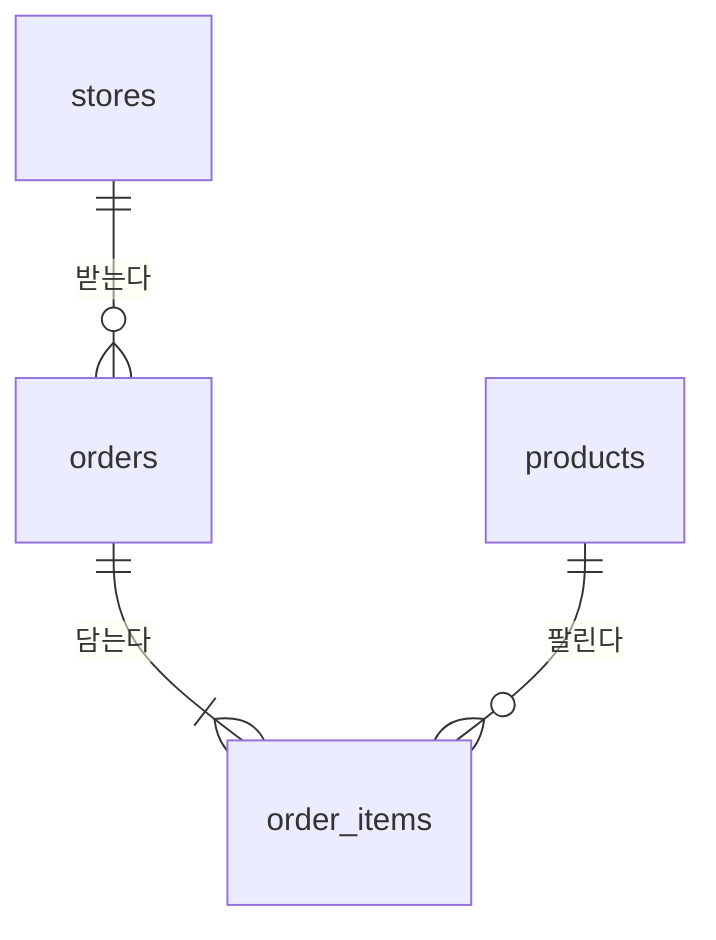

# 데이터 설계

가상의 외식 브랜드가 2025년 한 해 동안 낸 매출이다. `backend/scripts/seed.py` 가 만들고, 같은 시드로 돌리면 언제나 같은 파일이 나온다.

## 1. 표

### stores — 매장

| 열 | 타입 | 뜻 |
|---|---|---|
| store_id | INTEGER PK | |
| name | TEXT | 매장 이름. 예: 강남점 |
| region | TEXT | 지역. 서울 · 경기 · 부산 · 대구 · 광주 · 대전 |
| opened_on | TEXT | 개점일 `YYYY-MM-DD` |

### products — 상품

| 열 | 타입 | 뜻 |
|---|---|---|
| product_id | INTEGER PK | |
| name | TEXT | 상품 이름 |
| category | TEXT | 분류. 버거 · 사이드 · 음료 · 디저트 |
| unit_price | INTEGER | 정가(원) |

### orders — 주문

| 열 | 타입 | 뜻 |
|---|---|---|
| order_id | INTEGER PK | |
| store_id | INTEGER FK | 주문을 받은 매장 |
| ordered_on | TEXT | 주문일 `YYYY-MM-DD` |
| channel | TEXT | 경로. 매장 · 배달 · 포장 |

### order_items — 주문 상품

| 열 | 타입 | 뜻 |
|---|---|---|
| order_id | INTEGER FK | |
| product_id | INTEGER FK | |
| quantity | INTEGER | 수량 |
| unit_price | INTEGER | 판매 당시 단가(원). 할인이 있어 정가와 다를 수 있다 |

## 2. 정의

### 2.1 매출

**매출 = `order_items.quantity * order_items.unit_price` 의 합.** 정가(`products.unit_price`)가 아니다. 이 정의는 모델 프롬프트의 스키마 설명에도 그대로 들어간다 — 작은 모델이 가장 자주 틀리는 자리다.

### 2.2 주문 건수

**주문 건수 = `COUNT(DISTINCT orders.order_id)`.** `order_items` 를 JOIN 한 뒤 `COUNT(*)` 를 세면 주문이 아니라 주문 상품 줄 수가 된다. "주문 한 건당 평균" 은 매출 합을 이 수로 나눈 것이다 — `AVG(quantity * unit_price)` 는 상품 한 줄의 평균이라 틀린다.

### 2.3 strftime 의 결과는 문자열이다

`strftime('%m', ...)` 은 `'01'` ~ `'12'`, `strftime('%w', ...)` 은 `'0'`(일) ~ `'6'`(토) 의 **문자열**이다. `IN (0, 6)` 처럼 숫자와 비교하면 한 건도 걸리지 않는다.

### 2.4 날짜를 TEXT 로 둔 이유

SQLite 에는 날짜 타입이 없다. `YYYY-MM-DD` 문자열은 사전순이 곧 시간순이라 `BETWEEN` 과 `strftime` 이 그대로 된다.

## 3. 비즈니스 규칙

2절의 정의는 모델 프롬프트에 그대로 들어가고 평가 세트의 정답을 정한다. 규칙으로 두어 규칙 커버리지 검사(NFR-007)가 닿게 한다.

| ID | 규칙 | 위반 시 |
|---|---|---|
| DAT-R001 | 매출은 `order_items.quantity * order_items.unit_price` 의 합이다. 정가(`products.unit_price`)로 세지 않는다. 생성기 프롬프트에 이 정의와 「정가로 계산하지 않는다」가 실리고, 평가 세트의 정답도 이 정의를 따른다 | 할인이 빠져 매출이 부푼다 · 평가가 틀린 답을 맞다고 센다 |
| DAT-R002 | 주문 건수는 `COUNT(DISTINCT orders.order_id)` 다. 주문 한 건당 평균은 매출 합을 이 수로 나눈 것이다. 생성기 프롬프트에 이 정의가 실린다 | `order_items` 를 붙인 뒤 `COUNT(*)` 로 세어 주문 상품 줄 수를 주문 건수로 낸다 |
| DAT-R003 | `strftime` 의 결과는 문자열이라 문자열과만 견준다. 생성기 프롬프트에 `'%m'` · `'%w'` 의 값 범위와 함께 이 주의가 실린다 | `IN (0, 6)` 처럼 숫자와 견주어 한 건도 걸리지 않는다 |
| DAT-R004 | 같은 시드로 만든 매출 데이터는 언제나 같다 | 평가 세트의 정답이 데이터와 어긋난다 · 평가 결과를 견줄 수 없다 |

## 4. 테스트 사항

층은 [테스트 규칙](../convention/testing.md) 7.1 의 계층이다. 통합은 실제 시드 데이터(SQLite 파일)로 확인한다는 뜻이다. 평가 세트는 `backend/evaluation/questions.yaml` 의 정답 SQL 을 읽어 확인한다는 뜻이다. 프롬프트 문구는 평가로 고른 것이라(`docs/eval/README.md`) 테스트가 문구 그대로 견준다.

| 규칙 | 확인 | 층 |
|---|---|---|
| DAT-R001 | 실제 용어로 만든 프롬프트에 판매 단가로 센 매출 정의와 정가 금지가 있다. 평가 세트 정답이 정가로 돈을 세지 않는다 — 별칭 · 중첩 괄호 · 공통 식에서 곱해 둔 열까지 본다. 시드 데이터에 정가와 다른 판매 단가가 있어 두 방식의 매출이 다르다 | 의존성 · 평가 세트 · 통합 |
| DAT-R002 | 실제 용어로 만든 프롬프트에 주문 건수 정의와 한 건당 평균 정의가 있다. 시드 데이터에서 주문 상품을 붙여 센 줄 수가 주문 건수보다 많다 | 의존성 · 통합 |
| DAT-R003 | 프롬프트에 strftime 결과가 문자열이라는 주의가 있다. 시드 데이터에서 주말 주문을 숫자로 견주면 0건, 문자열로 견주면 0건보다 많다 | 의존성 · 통합 |
| DAT-R004 | 같은 시드로 서로 다른 프로세스에서 두 번 만든 데이터의 내용이 같다 | 통합 |
