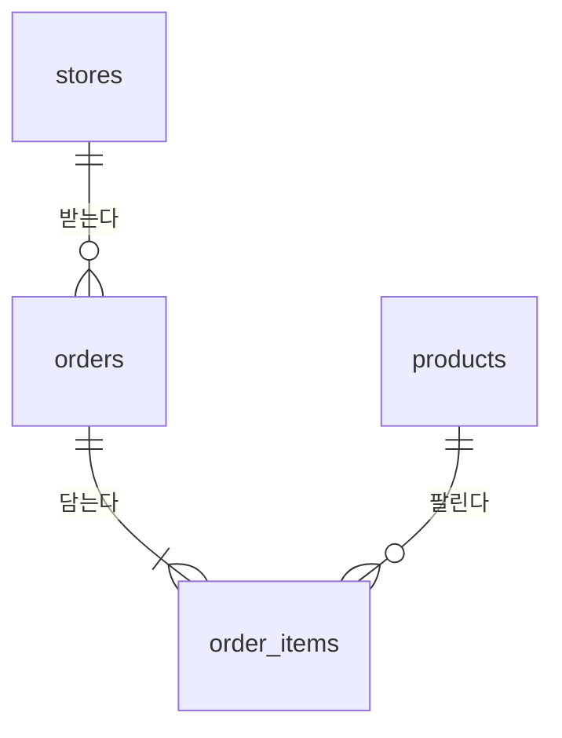

# 데이터 설계

가상의 외식 브랜드가 2025년 한 해 동안 낸 매출이다. `backend/scripts/seed.py` 가 만들고, 같은 시드로 돌리면 언제나 같은 파일이 나온다.

## 표

### stores — 매장

| 열 | 타입 | 뜻 |
|---|---|---|
| store_id | INTEGER PK | |
| name | TEXT | 매장 이름. 예: 강남점 |
| region | TEXT | 지역. 서울 · 경기 · 부산 · 대구 · 광주 · 대전 |
| opened_on | TEXT | 개점일 `YYYY-MM-DD` |

### products — 상품

| 열 | 타입 | 뜻 |
|---|---|---|
| product_id | INTEGER PK | |
| name | TEXT | 상품 이름 |
| category | TEXT | 분류. 버거 · 사이드 · 음료 · 디저트 |
| unit_price | INTEGER | 정가(원) |

### orders — 주문

| 열 | 타입 | 뜻 |
|---|---|---|
| order_id | INTEGER PK | |
| store_id | INTEGER FK | 주문을 받은 매장 |
| ordered_on | TEXT | 주문일 `YYYY-MM-DD` |
| channel | TEXT | 경로. 매장 · 배달 · 포장 |

### order_items — 주문 상품

| 열 | 타입 | 뜻 |
|---|---|---|
| order_id | INTEGER FK | |
| product_id | INTEGER FK | |
| quantity | INTEGER | 수량 |
| unit_price | INTEGER | 판매 당시 단가(원). 할인이 있어 정가와 다를 수 있다 |

## 매출의 정의

**매출 = `order_items.quantity * order_items.unit_price` 의 합.** 정가(`products.unit_price`)가 아니다. 이 정의는 모델 프롬프트의 스키마 설명에도 그대로 들어간다 — 작은 모델이 가장 자주 틀리는 자리다.

## 주문 건수의 정의

**주문 건수 = `COUNT(DISTINCT orders.order_id)`.** `order_items` 를 JOIN 한 뒤 `COUNT(*)` 를 세면 주문이 아니라 주문 상품 줄 수가 된다. "주문 한 건당 평균" 은 매출 합을 이 수로 나눈 것이다 — `AVG(quantity * unit_price)` 는 상품 한 줄의 평균이라 틀린다.

## strftime 의 결과는 문자열이다

`strftime('%m', ...)` 은 `'01'` ~ `'12'`, `strftime('%w', ...)` 은 `'0'`(일) ~ `'6'`(토) 의 **문자열**이다. `IN (0, 6)` 처럼 숫자와 비교하면 한 건도 걸리지 않는다.

## 날짜를 TEXT 로 둔 이유

SQLite 에는 날짜 타입이 없다. `YYYY-MM-DD` 문자열은 사전순이 곧 시간순이라 `BETWEEN` 과 `strftime` 이 그대로 된다.
