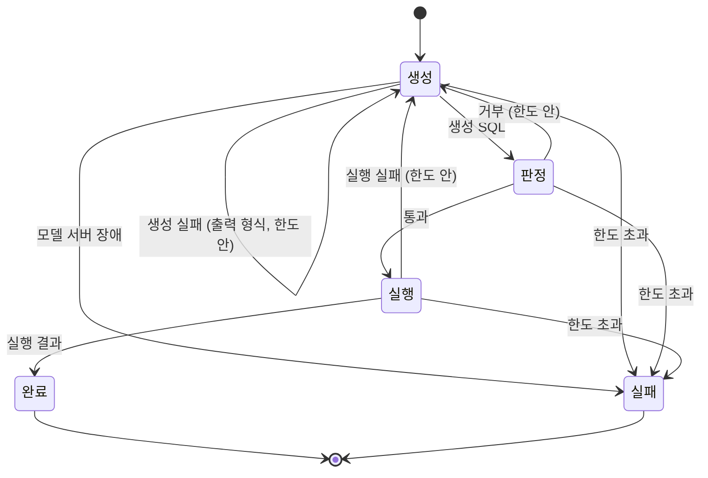

# 질의(query) 설계서

자연어 질문을 SQL 로 바꿔 검증하고 실행하는 Agent 의 설계다. 요구사항은 `docs/requirements.md` 가 갖는다.

## 1. 목적

### 다루는 것

* 질문 받기와 입력 검증 (FR-001)
* SQL 생성 · 검증 · 실행과 재생성 (FR-001 · FR-004 · FR-005)
* 단계별 진행 (FR-002 · FR-003)
* 질문 하나의 시간 상한 (NFR-003)
* 보조 조회: 표 · 열 (FR-006), 예시 질문 (FR-007) — 2.4

### 용어

* **판정** — 생성 SQL 을 실행해도 되는지 보는 일이다. 요구사항의 「검증」(용어 절 · `FR-002` · `FR-004`)이 이것이다. 질문의 모양을 보는 **입력 검증**(2.3)과 헷갈리지 않게 이 설계서는 SQL 쪽을 판정이라 부른다. 판정을 통과한 질의 단계의 이름은 「검증됨」이다.
* **사유** — 실패를 설명하는 사용자에게 보이는 말이다. 재생성할 때는 직전 실패의 사유가 다음 생성에 넘어간다.

### 다루지 않는 것

* 결과 요약 문장 — 요구사항 4절
* 대화 이어가기 — 요구사항 4절
* 화면에서 단계를 어떻게 보일지 — 화면 설계서의 몫이다 (아직 없다)

## 2. 처리 흐름

### 2.1 질의 흐름

질문 하나를 받아 생성 · 판정 · 실행을 되풀이하며, 단계가 하나 끝날 때마다 **질의 단계**(5절)를 하나 낸다. 흐름의 상태(시도 번호 · 직전 실패 사유)는 유스케이스 안에만 둔다.



1. **생성** — 생성기(5.2)에 질문 · 표 · 용어 · 직전 실패를 넘겨 **생성 SQL** 또는 **생성 실패**를 받는다.
2. **판정** — SQL 분석기가 생성 SQL 을 **SQL 구성**으로 옮기고, 규칙이 그것을 보고 **판정**을 낸다 (`QRY-R002` ~ `QRY-R005`). 통과하고 판정에 붙일 행 상한이 있으면 SQL 분석기가 그 상한을 붙인 SQL 을 만든다. 붙일 행 상한이 없으면 생성 SQL 글을 그대로 쓴다 — 판정한 글과 실행하는 글이 같아야 한다.
3. **실행** — 매출 DB 가 읽기 전용으로 실행해 **실행 결과** 또는 **실행 실패**를 낸다 (`QRY-R008` · `QRY-R009`). 규칙이 행 상한으로 자르고 값을 정리한다 (`QRY-R005` · `QRY-R014`).
4. **다음에 무엇을 할지는 규칙이 정한다.** 실패가 나면 규칙이 시도 번호 · 실패 · 질의 한도를 보고 재생성 · 실패 가운데 하나를 고르고, 사용자에게 보일 사유를 짓는다 (`QRY-R006` · `QRY-R007` · `QRY-R009` · `QRY-R010` · `QRY-R013` · `QRY-R015`). 예상하지 못한 오류로 끝낼 때의 사유도 규칙이 정한다 (`QRY-R012`).

질의 흐름은 유스케이스다. 흐름을 이끄는 도구(LangGraph)와 그 상태는 유스케이스 안의 일이고, 밖으로는 질의 단계만 낸다.

### 2.2 질의 단계와 API

질의 단계는 모델이고, API 가 SSE 이벤트(DTO)로 옮긴다 (`QRY-R012`).

| 질의 단계 | 언제 | SSE 이벤트 | 담는 것 |
|---|---|---|---|
| 생성됨 | 생성기가 생성 SQL 을 냈을 때 | `generated` | `attempt` · `sql` |
| 거부됨 | 생성 · 판정 · 실행이 실패해 재생성할 때 | `rejected` | `attempt` · `stage` · `reason` |
| 검증됨 | 판정이 통과했을 때 | `validated` | `sql` (실행되는 SQL 그대로 — 행 상한을 붙였거나, 붙일 것이 없으면 생성 SQL 글 그대로) |
| 완료 | 실행 결과가 나왔을 때 | `done` | `columns` · `rows` · `truncated` |
| 실패 | 끝내 실패했을 때 | `failed` | `reason` |

마지막 단계는 항상 완료나 실패 하나다.

### 2.3 입력 검증

질문의 모양(`QRY-R001`)은 규칙이 질문 모델을 보고 판단한다. 질의 유스케이스가 흐름을 시작하기 전에 그 규칙으로 질문을 보고, 맞지 않으면 흐름을 시작하지 않고 사유를 돌려준다. API 는 그것을 422 로 옮긴다. **API 는 규칙을 직접 부르지 않는다** ([코드 아키텍처](../convention/code-architecture.md) 2.5).

### 2.4 보조 조회

질의 흐름을 거치지 않는 읽기 전용 조회다. 보조 조회 유스케이스가 맡는다.

| 경로 | 돌려주는 것 | 규칙 |
|---|---|---|
| `GET /api/schema` | 표마다 이름 · 설명 · 열(이름 · 타입 · 설명) | `QRY-R017` |
| `GET /api/examples` | 예시 질문 목록 | `QRY-R018` |
| `GET /api/health` | 상태와 쓰는 모델 이름 | 이미지의 헬스 체크가 쓴다 |

## 3. 비즈니스 규칙

| ID | 규칙 | 위반 시 |
|---|---|---|
| QRY-R001 | 질문은 앞뒤 공백을 뺀 길이가 1자 이상 300자 이하다. 안쪽 공백은 길이에 든다 | 질의 흐름을 시작하지 않고 422 로 거부 |
| QRY-R002 | SQL 은 구문 분석이 되는 한 문장이어야 한다. 구문 · 토큰 오류와 세미콜론으로 이은 여러 문장은 거부한다 | 뒤 문장으로 쓰기 SQL 을 끼워 넣을 수 있다 · 분석 오류가 흐름 밖으로 새어 스트림이 끊긴다 |
| QRY-R003 | 조회문(`SELECT`, `WITH ... SELECT`)만 허용한다. 문장 안 어디에든 쓰기 · 정의 · 관리 · 트랜잭션 구문(INSERT · UPDATE · DELETE · MERGE · CREATE · DROP · ALTER · PRAGMA · ATTACH · DETACH · BEGIN · COMMIT 등)이 있으면 거부한다 | 데이터 변경 (NFR-001) |
| QRY-R004 | 허용된 표만 참조한다. CTE 이름은 한정자 없이 쓸 때만 허용된 표로 친다. 기본 스키마를 붙인 이름(SQLite 의 `main.x`)은 실제 허용 표일 때만 받고, 다른 스키마를 붙인 이름은 거부한다. 표 값 함수(`FROM f()`)는 언제나 거부한다. 표 · CTE 이름은 대소문자를 가리지 않고 견준다(SQLite 와 같다) | 내부 표 · DB 경로 노출 (NFR-008) · 멀쩡한 조회를 대소문자 때문에 거부 |
| QRY-R005 | 바깥 `LIMIT` 이 없거나, 음수이거나, 상한(200)보다 크면 `LIMIT 상한+1` 로 둔다. 0 이상 상한 이하의 `LIMIT` 은 그대로 둔다 — 이때는 생성 SQL 글을 그대로 실행한다. 매출 DB 는 상한+1 행까지만 가져온다. 결과가 상한을 넘으면 상한만큼만 돌려주고 잘렸다고 알린다 | 큰 결과로 화면과 메모리가 막힘 (NFR-004) · 잘렸는지 모름 |
| QRY-R006 | 생성 · 판정 · 실행이 실패하면 사유를 붙여 다시 생성한다. 생성은 처음 포함 최대 3회다 | 한 번의 실수로 질문 전체가 실패 |
| QRY-R007 | 생성 한도를 넘으면 실패로 끝내고 마지막 사유를 알린다 | 끝없는 재시도 |
| QRY-R008 | DB 는 읽기 전용으로 연다. 판정을 통과한 SQL 이라도 쓰기는 DB 가 거부한다 | 판정이 뚫렸을 때 데이터 변경 |
| QRY-R009 | 실행이 제한 시간(기본 5초)을 넘으면 중단하고 실행 실패로 다룬다. 다음 생성에 넘길 사유는 제한 시간과, 더 가벼운 질의로 바꾸라는 안내다 | 무거운 질의가 서버를 붙잡음 (NFR-004) · 모델이 같은 무거운 질의를 되풀이 |
| QRY-R010 | 모델 출력이 JSON 이 아니거나 `sql` 이 비어 있으면 생성 실패(출력 형식)로 다룬다. 코드 펜스(` ```json ... ``` `)로 감싼 JSON 은 펜스를 걷어 받는다. 출력 형식 실패는 모델 서버 장애가 아니므로 생성기가 지은 세부를 사유로 붙여 다시 생성한다 | 파싱 오류로 서버 오류 · 작은 모델이 자주 붙이는 펜스 때문에 멀쩡한 SQL 을 버림 |
| QRY-R011 | 실행 뒤에는 생성기를 부르지 않는다. 결과는 DB 가 낸 값 그대로 돌려준다 | 숫자 왜곡 (NFR-002) |
| QRY-R012 | 질의 단계를 일어난 순서대로 내고, 마지막은 완료나 실패 하나다. 예상하지 못한 오류도 규칙이 정한 사유로 실패로 바꿔 끝낸다 | 화면이 끝을 알 수 없음 |
| QRY-R013 | 모델 서버 장애 — 연결 실패 · 오류 응답(모델 없음 등) · 응답 시간 초과 — 면 재생성하지 않고, 장애 종류를 알 수 있는 사유로 바로 끝낸다 | 장애 중에 같은 요청 반복, 사용자 대기만 늘어남 · 무엇을 고쳐야 할지 모름 |
| QRY-R014 | 결과 값 가운데 바이트 값은 그대로 보내지 않고 `<binary>` 로 바꾼다 | JSON 직렬화 오류 |
| QRY-R015 | 실행 실패가 「별칭의 표 없음」(`no such column: 별칭.열`)이면, 그 별칭의 표를 FROM · JOIN 에 넣었는지 확인하라는 안내를 사유에 덧붙인다 | 모델이 같은 실수를 되풀이해 재생성이 헛돈다 |
| QRY-R016 | 질문 하나의 최악 시간 `생성 최대 횟수 × (생성 제한 시간 + 실행 제한 시간)` 이 60초를 넘는 질의 한도면 서버가 뜨지 않는다 | 1분 상한(NFR-003)을 지킬 수 없는 설정으로 운영됨 |
| QRY-R017 | 표 · 열 조회는 DB 에 있는 표와 열을 그 순서대로 돌려준다. 업무 설명은 규칙이 용어에서 붙이고, 없으면 빈 문자열이다 | 화면이 DB 에 없는 표를 보이거나 있는 표를 빠뜨림 |
| QRY-R018 | 예시 질문은 예시 질의의 질문과 겹치지 않는다 | 예시 질문만 잘 되는 것처럼 보임 |

**QRY-R004 를 좁힌 근거.** 감사 1차(#17)에서 두 우회가 나왔다. sqlglot 은 `FROM f()` 의 표 이름을 빈 문자열로 주고, SQLite 는 `main.X` 를 CTE 가 아니라 실제 객체로 푼다. 이름만 보는 검사로는 둘 다 빠져나간다. 그래서 SQL 구성의 표 참조는 이름 · 한정자 종류 · 함수인지를 따로 갖는다. `main` 이 기본 스키마라는 것은 SQLite 방언이라, SQL 분석기가 한정자 종류로 옮기고 규칙은 종류만 본다.

**QRY-R005 를 바꾼 근거.** 상한만큼 `LIMIT` 을 붙이면, 결과가 정확히 상한 개수일 때 잘린 것인지 아닌지 알 수 없다(감사 #17). 한 행 더 가져와 보면 안다. 그래서 검증됨 단계의 SQL 은 `LIMIT 201` 이다. SQLite 는 음수 `LIMIT` 을 상한 없음으로 푼다. 음수를 「상한 이하」로 보고 그대로 두면 상한이 사라지므로, 없는 것과 같이 다룬다.

**QRY-R013 을 넓힌 근거.** 오류 응답과 시간 초과는 엄밀히는 "닿지 않음" 이 아니지만(감사 #17), 다시 만들어도 나아지지 않는다는 점은 같다. 모델이 없으면 받아야 하고, 느리면 더 작은 모델이나 GPU 가 필요하다. 다만 사용자가 무엇을 고칠지 알 수 있게 사유를 셋으로 나눈다.

**QRY-R015 를 더한 근거.** 평가 1차(`docs/eval/README.md`)에서 1.5B 모델이 JOIN 없이 `o.ordered_on` 을 쓰고, DB 오류만 받아서는 세 번 모두 같은 SQL 을 냈다. 오류 문장을 그대로 넘기는 것만으로는 작은 모델이 고칠 곳을 찾지 못한다.

**QRY-R016 을 더한 근거.** 생성 제한 시간 60초가 코드에만 있어, 최악이면 3분이 걸릴 수 있었다(감사 #17). 기본값은 `3 × (15 + 5) = 60초` 다.

## 4. 테스트 사항

층은 [테스트 규칙](../convention/testing.md) 7.1 의 계층이다 — 규칙 · 유스케이스 · 의존성 · API. **통합**은 의존성 구현 가운데 실제 파일 · DB 에 닿아야 보이는 것을 확인하는 테스트다(`tests/integration/`).

| 규칙 | 확인 | 층 |
|---|---|---|
| QRY-R001 | 빈 질문 · 공백뿐인 질문 · 301자 질문은 거부, 300자는 받는다. 앞뒤 공백은 세지 않고, 안쪽 공백은 센다. API 는 422 | 규칙 · API |
| QRY-R002 | 문장이 둘인 SQL 구성 · 분석 오류가 있는 SQL 구성은 거부. SQL 분석기가 `SELECT 1; DELETE FROM orders` 를 문장 둘로, 닫히지 않은 따옴표를 분석 오류로 옮긴다. 닫히지 않은 따옴표면 재생성한다 | 규칙 · 의존성 · 유스케이스 |
| QRY-R003 | 조회문이 아닌 SQL 구성 · 금지 구문이 든 SQL 구성은 거부, WITH 조회는 통과. SQL 분석기가 INSERT · UPDATE · DELETE · DROP · PRAGMA · ATTACH · BEGIN 과 CTE 안의 DELETE 를 금지 구문으로 옮긴다 | 규칙 · 의존성 |
| QRY-R004 | `sqlite_master` 참조 거부, CTE 이름 허용, 함수 참조 거부, CTE 로 가린 `main.sqlite_master` 거부, `main.orders` 허용, 다른 스키마의 `orders` 거부, 대소문자만 다른 표 이름 · CTE 이름 허용. SQL 분석기가 `pragma_database_list()` 를 함수 참조로, `main.x` · `MAIN.x` 를 기본 스키마 한정자로, 그 밖의 한정자를 다른 스키마로 옮긴다 | 규칙 · 의존성 |
| QRY-R005 | 바깥 행 상한 없음 → 201, 500 → 201, -1 → 201, 10 → 그대로. 가져올 행 수는 상한+1. 상한+1 행이면 상한만큼과 잘림, 정확히 상한이면 잘리지 않음. SQL 분석기가 행 상한을 붙인 SQL 을 만든다. 붙일 행 상한이 없으면 검증됨 단계의 SQL 이 생성 SQL 글 그대로다. 매출 DB 가 가져올 행 수만큼만 돌려준다 | 규칙 · 의존성 · 유스케이스 · 통합 |
| QRY-R006 | 실패 뒤 한도 안이면 재생성, 사유가 다음 생성에 넘어간다. 첫 생성이 쓰기 SQL 이면 두 번째로 성공 | 규칙 · 유스케이스 |
| QRY-R007 | 한도에 닿으면 실패와 마지막 사유. 세 번 모두 실패하면 마지막 질의 단계가 「실패」 | 규칙 · 유스케이스 |
| QRY-R008 | 읽기 전용 연결에 `DELETE` 를 직접 넣으면 DB 가 거부 | 통합 |
| QRY-R009 | 무거운 재귀 질의가 제한 시간에 끊겨 실행 실패(시간 초과). 시간 초과의 사유에 제한 시간과, 더 가벼운 질의로 바꾸라는 안내가 있다 | 규칙 · 통합 |
| QRY-R010 | 생성기가 JSON 아님 · `sql` 없음을 생성 실패(출력 형식)로 옮기고, 코드 펜스는 걷어 받는다. 출력 형식 실패면 한도 안에서 재생성하고 세부가 사유에 남는다 | 규칙 · 의존성 · 유스케이스 |
| QRY-R011 | 완료 시 생성기 호출이 한 번뿐 | 유스케이스 |
| QRY-R012 | 단계 순서 생성됨 → 검증됨 → 완료, 실패 시 마지막이 실패. 생성기가 예상하지 못한 예외를 던져도 마지막이 실패. 예상하지 못한 오류의 사유가 비어 있지 않다. SSE 로 같은 순서 | 규칙 · 유스케이스 · API |
| QRY-R013 | 모델 서버 장애면 재생성하지 않고 실패, 장애 종류마다 다른 사유. 생성기가 연결 실패 · 오류 응답 · 시간 초과를 각각의 생성 실패로 옮긴다 | 규칙 · 의존성 · 유스케이스 |
| QRY-R014 | 바이트 값이 `<binary>` 로 바뀐다 | 규칙 |
| QRY-R015 | 별칭의 표 없음이면 사유에 별칭과 JOIN 안내가 붙고, 다른 실행 실패는 그대로. 매출 DB 가 `no such column: o.ordered_on` 을 별칭 `o` 의 실행 실패로 옮긴다 | 규칙 · 의존성 |
| QRY-R016 | 기본 질의 한도는 받는다. 생성 제한 시간 30초면 거부한다 | 규칙 |
| QRY-R017 | DB 의 표 · 열 순서 그대로, 용어의 설명이 붙고 없으면 빈 문자열 | 규칙 · 유스케이스 · API |
| QRY-R018 | 예시 질문과 예시 질의의 질문이 겹치지 않는다 | 규칙 |

**규칙 ID 는 테스트 이름이나 문서 문자열에 그대로 적는다.** `tests/test_rule_coverage.py` 가 3절 · 4절의 ID 와 테스트 코드의 ID 를 대조해, 빠진 것이 있으면 실패한다 (NFR-007).

## 5. 모델과 의존

### 5.1 모델

모델은 데이터 형태만 가진다. 판단은 3절 규칙이 한다 ([코드 아키텍처](../convention/code-architecture.md) 2.1).

**질문과 데이터**

| 모델 | 필드 | 뜻 |
|---|---|---|
| **질문** | 글 | 사용자가 적은 물음 |
| **표** | 이름, 업무 설명, 열 목록 | 물어볼 수 있는 표 |
| **열** | 이름, 타입, 업무 설명 | 표의 열 |
| **예시 질의** | 질문, SQL | 생성기가 언어 모델에게 보여 줄 본보기 |
| **용어** | 매출의 정의, 주문 건수의 정의, 표 · 열의 업무 설명, 예시 질의 목록, 예시 질문 목록 | `data.md` 의 업무 정의. 바뀌지 않는 값이다 |

**질의 한 번**

| 모델 | 필드 | 뜻 |
|---|---|---|
| **생성 SQL** | 시도 번호, SQL 글 | 생성기가 낸 SQL. 첫 시도가 1 이다 |
| **SQL 구성** | 분석 오류, 문장 수, 조회문인지, 금지 구문 목록, 표 참조 목록, CTE 이름 목록, 바깥 행 상한 | 생성 SQL 이 **무엇을 하는지**를 업무 말로 나타낸 것. SQL 분석기가 만든다. 분석 오류가 있으면 나머지는 의미가 없다. 바깥 행 상한은 없거나 수가 아니면 비어 있고, 음수는 그대로 싣는다(`QRY-R005`) |
| **표 참조** | 이름, 한정자 종류, 함수인지 | SQL 구성 안의 참조 하나. 한정자 종류는 없음 · 기본 스키마 · 다른 스키마다 |
| **판정** | 통과(붙일 행 상한) 또는 거부(사유) | 규칙이 SQL 구성을 보고 낸 답. 붙일 행 상한이 비어 있으면 SQL 을 그대로 둔다 |
| **실행 결과** | 열 이름 목록, 행 목록, 잘렸는지 | DB 가 낸 값. 매출 DB 는 가져올 행 수(상한+1)까지 담아 내고, 규칙이 상한으로 자른 뒤에는 상한까지만 담는다 |
| **질의 단계** | 생성됨(시도 번호, SQL) · 거부됨(시도 번호, 실패 단계, 사유) · 검증됨(SQL) · 완료(실행 결과) · 실패(사유) | 진행 중에 일어난 일 하나 (2.2) |

**실패와 한도**

| 모델 | 필드 | 뜻 |
|---|---|---|
| **생성 실패** | 종류, 세부 | 종류는 출력 형식 · 연결 실패 · 오류 응답 · 시간 초과. 세부는 바깥이 준 말 그대로다. 출력 형식 실패의 세부만 생성기가 짓는다 (5.2) |
| **실행 실패** | 종류, 별칭, 세부 | 종류는 시간 초과 · 별칭의 표 없음 · 그 밖의 거부. 별칭은 「별칭의 표 없음」일 때만 있다 |
| **질의 한도** | 생성 최대 횟수, 행 상한, 생성 제한 시간, 실행 제한 시간 | 설정에서 온 한도 (5.3) |

**실패 단계 · 한정자 종류 · 실패 종류는 열거다.** 실패 단계(생성 · 판정 · 실행 — 어느 단계에서 실패했는지), 한정자 종류(없음 · 기본 스키마 · 다른 스키마), 생성 실패 종류, 실행 실패 종류는 모델 옆의 열거로 둔다.

### 5.2 의존

유스케이스가 바깥에서 받는 것이다. 인터페이스는 모델만 주고받는다.

| 의존성 | 받는 것 | 내는 것 | 구현이 아는 바깥 |
|---|---|---|---|
| **생성기** | 질문, 표 목록, 용어, 시도 번호, 직전 실패 사유 | 생성 SQL 또는 생성 실패 | 언어 모델(Ollama), 프롬프트 형식, 출력 형식(JSON) |
| **SQL 분석기** | 생성 SQL 의 글 | SQL 구성 | SQL 방언(SQLite), sqlglot |
| | SQL 글, 행 상한 | 행 상한을 붙인 SQL 글 | |
| **매출 DB** | — | 표 목록 (이름 · 타입만. 설명은 규칙이 용어에서 붙인다 — `QRY-R017`) | SQLite |
| | SQL 글, 가져올 행 수 | 실행 결과(가져올 행 수까지) 또는 실행 실패 | |

* **바깥의 실패는 실패 모델로 옮겨 돌려준다.** 예외로 흐름을 끊지 않는다. 바깥 라이브러리의 예외 · 객체가 구현 밖으로 나가지 않는다.
* **구현은 판단하지 않는다.** 실패를 어떻게 안내할지, 재생성할지는 규칙이 정한다.
* 생성기는 프롬프트에 무엇을 넣을지(용어 · 예시 질의 · 직전 실패 사유)를 받은 모델로 짓는다. 프롬프트의 말투와 형식은 구현 안의 일이다.
* **출력 형식 실패의 세부는 생성기가 짓는다** — 출력 형식(JSON)을 고치라는 안내다. 출력 형식은 생성기만 아는 바깥이라서다. 규칙은 그 세부를 사유로 그대로 넘긴다 (`QRY-R010`).

### 5.3 설정

| 이름 | 기본값 | 뜻 |
|---|---|---|
| `OLLAMA_BASE_URL` | `http://localhost:11434` | 모델 서버 주소 |
| `OLLAMA_MODEL` | `qwen2.5-coder:1.5b` | 쓸 모델 |
| `GENERATION_TIMEOUT_SECONDS` | `15` | 생성 한 번의 제한 시간 — 질의 한도 (`QRY-R013` · `QRY-R016`) |
| `SALES_DB_PATH` | `data/sales.db` | DB 파일. 없으면 서버가 뜨지 않는다 (`backend/scripts/seed.py` 로 만든다) |
| `MAX_ATTEMPTS` | `3` | 생성 최대 횟수 — 질의 한도 (`QRY-R006`) |
| `ROW_LIMIT` | `200` | 행 상한 — 질의 한도 (`QRY-R005`) |
| `QUERY_TIMEOUT_SECONDS` | `5` | 실행 제한 시간 — 질의 한도 (`QRY-R009`) |
| `STATIC_DIR` | `static` | 빌드된 화면. 없으면 API 만 뜬다 |
