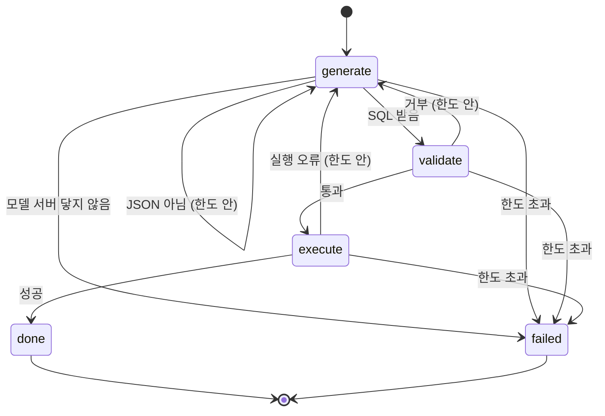

# 질의(query) 설계서

자연어 질문을 SQL 로 바꿔 검증하고 실행하는 Agent 의 설계다. 요구사항은 `docs/requirements.md` 가 갖는다.

## 1. 목적

### 다루는 것

* 질문 받기와 입력 검증 (FR-001)
* SQL 생성 · 검증 · 실행과 재생성 루프 (FR-001 · FR-004 · FR-005)
* 단계별 진행 이벤트 (FR-002 · FR-003)
* 스키마 조회 (FR-006) · 예시 질문 (FR-007)

### 다루지 않는 것

* 결과 요약 문장 — 요구사항 4절
* 대화 이어가기 — 요구사항 4절

## 2. 처리 흐름

### 2.1 그래프



### 2.2 상태

| 필드 | 뜻 |
|---|---|
| `question` | 사용자 질문 |
| `sql` | 마지막으로 만든 SQL. 검증을 통과하면 LIMIT 을 보정한 SQL 로 바뀐다 |
| `attempt` | 지금까지 생성을 부른 횟수. 첫 생성이 1 이다 |
| `feedback` | 직전 실패 사유. 다음 생성의 프롬프트에 붙는다 |
| `columns` · `rows` | 실행 결과 |
| `truncated` | 상한 때문에 행이 잘렸는지 |
| `outcome` | `running` · `done` · `failed` |

### 2.3 단계

1. **generate** — 질문, 스키마, 예시, 직전 실패 사유로 프롬프트를 만들어 모델에게 SQL 을 받는다.
   * 모델 출력이 JSON 이 아니거나 `sql` 키가 없으면 실패 사유로 다룬다 (`QRY-R010`).
   * 모델 서버에 닿지 않으면 재생성하지 않고 끝낸다 (`QRY-R013`).
2. **validate** — 규칙으로 판정한다 (`QRY-R002` ~ `QRY-R005`). 통과하면 LIMIT 을 보정한 SQL 로 바꾼다.
3. **execute** — 읽기 전용 연결로 실행한다 (`QRY-R008` · `QRY-R009`).
4. 2·3 에서 실패하면 사유를 `feedback` 에 담아 1 로 돌아간다. 한도를 넘으면 끝낸다 (`QRY-R006` · `QRY-R007`).

### 2.4 이벤트

API 는 단계가 끝날 때마다 이벤트를 하나씩 흘려보낸다 (`QRY-R012`).

| 이벤트 | 언제 | 담는 것 |
|---|---|---|
| `generated` | 생성이 SQL 을 냈을 때 | `attempt` · `sql` |
| `rejected` | 생성·검증·실행이 실패해 재생성할 때 | `attempt` · `stage` · `reason` |
| `validated` | 검증을 통과했을 때 | `sql` (보정된 것) |
| `done` | 실행이 끝났을 때 | `columns` · `rows` · `truncated` |
| `failed` | 끝내 실패했을 때 | `reason` |

마지막 이벤트는 항상 `done` 이나 `failed` 하나다.

## 3. 비즈니스 규칙

| ID | 규칙 | 위반 시 |
|---|---|---|
| QRY-R001 | 질문은 공백을 뺀 길이가 1자 이상 300자 이하다 | 그래프를 돌리지 않고 422 로 거부 |
| QRY-R002 | SQL 은 한 문장이어야 한다. 세미콜론으로 이은 여러 문장은 거부한다 | 뒤 문장으로 쓰기 SQL 을 끼워 넣을 수 있다 |
| QRY-R003 | 조회문(`SELECT`, `WITH ... SELECT`)만 허용한다. 문장 안 어디에든 쓰기·정의 구문이 있으면 거부한다 | 데이터 변경 (NFR-001) |
| QRY-R004 | 허용된 표만 참조한다. CTE 이름은 한정자 없이 쓸 때만 허용된 표로 친다. 스키마를 붙인 이름(`main.x`)은 실제 허용 표일 때만 받는다. 표 값 함수(`FROM f()`)는 언제나 거부한다 | 내부 표 · DB 경로 노출 (NFR-008) |
| QRY-R005 | 바깥 `LIMIT` 이 없으면 200 을 붙이고, 200 보다 크면 200 으로 줄인다 | 큰 결과로 화면과 메모리가 막힘 (NFR-004) |
| QRY-R006 | 생성 · 검증 · 실행이 실패하면 사유를 붙여 다시 생성한다. 생성은 처음 포함 최대 3회다 | 한 번의 실수로 질문 전체가 실패 |
| QRY-R007 | 생성 한도를 넘으면 실패로 끝내고 마지막 사유를 알린다 | 끝없는 재시도 |
| QRY-R008 | DB 는 읽기 전용으로 연다. 검증을 통과한 SQL 이라도 쓰기는 DB 가 거부한다 | 검증이 뚫렸을 때 데이터 변경 |
| QRY-R009 | 실행이 제한 시간(기본 5초)을 넘으면 중단하고 실행 실패로 다룬다 | 무거운 질의가 서버를 붙잡음 (NFR-004) |
| QRY-R010 | 모델 출력이 JSON 이 아니거나 `sql` 이 비어 있으면 생성 실패로 다룬다 | 파싱 오류로 서버 오류 |
| QRY-R011 | 실행 뒤에는 모델을 부르지 않는다. 결과는 DB 가 낸 값 그대로 돌려준다 | 숫자 왜곡 (NFR-002) |
| QRY-R012 | 단계 이벤트를 일어난 순서대로 흘려보내고, 마지막은 `done` 이나 `failed` 하나다 | 화면이 끝을 알 수 없음 |
| QRY-R013 | 모델 서버에 닿지 않으면 재생성하지 않고 바로 실패로 끝낸다 | 장애 중에 같은 요청 반복, 사용자 대기만 늘어남 |
| QRY-R014 | 결과 값 가운데 바이트 값은 그대로 보내지 않고 `<binary>` 로 바꾼다 | JSON 직렬화 오류 |
| QRY-R015 | 실행 오류가 `no such column: 별칭.열` 이면, 그 별칭의 표를 FROM · JOIN 에 넣었는지 확인하라는 안내를 사유에 덧붙인다 | 모델이 같은 실수를 되풀이해 재생성이 헛돈다 |

**QRY-R004 를 좁힌 근거.** 감사 1차(#17)에서 두 우회가 나왔다. sqlglot 은 `FROM f()` 의 표 이름을 빈 문자열로 주고, SQLite 는 `main.X` 를 CTE 가 아니라 실제 객체로 푼다. 이름만 보는 검사로는 둘 다 빠져나간다.

**QRY-R015 를 더한 근거.** 평가 1차(`docs/eval/README.md`)에서 1.5B 모델이 JOIN 없이 `o.ordered_on` 을 쓰고, DB 오류만 받아서는 세 번 모두 같은 SQL 을 냈다. 오류 문장을 그대로 넘기는 것만으로는 작은 모델이 고칠 곳을 찾지 못한다.

## 4. 테스트 사항

| 규칙 | 확인 | 층 |
|---|---|---|
| QRY-R001 | 빈 질문 · 공백뿐인 질문 · 301자 질문은 422. 300자는 받는다 | API |
| QRY-R002 | `SELECT 1; DELETE FROM orders` 거부 | 단위 |
| QRY-R003 | INSERT · UPDATE · DELETE · DROP · PRAGMA · ATTACH 거부. CTE 안의 DELETE 거부. WITH 조회 허용 | 단위 |
| QRY-R004 | `sqlite_master` 거부. CTE 이름 허용. `pragma_database_list()` · `pragma_table_info('x')` 거부. CTE 로 가린 `main.sqlite_master` 거부. `main.orders` 허용 | 단위 |
| QRY-R005 | LIMIT 없음 → 200 추가, LIMIT 500 → 200, LIMIT 10 → 그대로 | 단위 |
| QRY-R006 | 첫 생성이 쓰기 SQL 이면 사유를 붙여 다시 생성하고, 두 번째로 성공 | 그래프 |
| QRY-R007 | 세 번 모두 실패하면 `failed` 와 마지막 사유 | 그래프 |
| QRY-R008 | 읽기 전용 연결에 `DELETE` 를 직접 넣으면 DB 가 거부 | 통합 |
| QRY-R009 | 무거운 재귀 질의가 제한 시간에 끊긴다 | 통합 |
| QRY-R010 | JSON 아님 · `sql` 없음 → 재생성 | 그래프 · 단위 |
| QRY-R011 | 성공 시 생성기 호출이 한 번뿐 | 그래프 |
| QRY-R012 | 이벤트 순서 `generated → validated → done`. 실패 시 마지막이 `failed` | API |
| QRY-R013 | 모델 서버 연결 실패 시 생성 호출 한 번 뒤 바로 `failed` | 그래프 |
| QRY-R014 | 바이트 값이 `<binary>` 로 바뀐다 | 단위 |
| QRY-R015 | `no such column: o.ordered_on` → 안내에 별칭 `o` 와 JOIN 이 들어간다. 다른 오류는 그대로 | 단위 · 그래프 |

**규칙 ID 는 테스트 이름이나 문서 문자열에 그대로 적는다.** `tests/test_rule_coverage.py` 가 이 절의 ID 와 테스트 코드의 ID 를 대조해, 빠진 것이 있으면 실패한다 (NFR-007).

## 5. 모델과 의존

### 포트

```python
class SqlGenerator(Protocol):
    async def generate(self, prompt: str) -> str: ...   # 모델의 날 출력

class SalesDatabase(Protocol):
    def schema(self) -> list[Table]: ...
    def execute(self, sql: str) -> QueryResult: ...
```

* 생성기는 **문자열만 돌려준다.** JSON 해석은 `rules.parse_generation` 이 한다 — 어댑터가 바뀌어도 해석 규칙은 한 곳에 있다.
* 모델 서버에 닿지 않으면 생성기는 `GeneratorUnavailable` 을 던진다. 그래프는 이것만 보고 `QRY-R013` 을 적용한다.

### 설정

| 이름 | 기본값 | 뜻 |
|---|---|---|
| `OLLAMA_BASE_URL` | `http://localhost:11434` | 모델 서버 주소 |
| `OLLAMA_MODEL` | `qwen2.5-coder:1.5b` | 쓸 모델 |
| `SALES_DB_PATH` | `data/sales.db` | DB 파일 |
| `MAX_ATTEMPTS` | `3` | 생성 최대 횟수 (`QRY-R006`) |
| `ROW_LIMIT` | `200` | 행 상한 (`QRY-R005`) |
| `QUERY_TIMEOUT_SECONDS` | `5` | 실행 제한 시간 (`QRY-R009`) |
